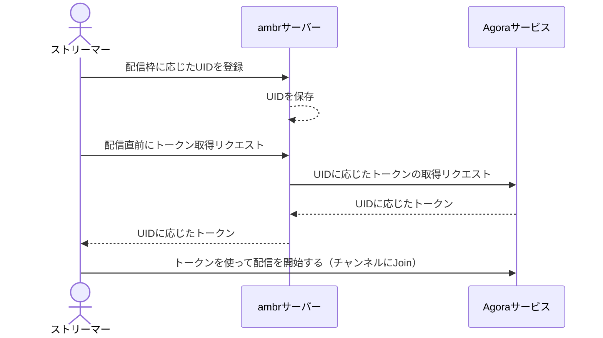
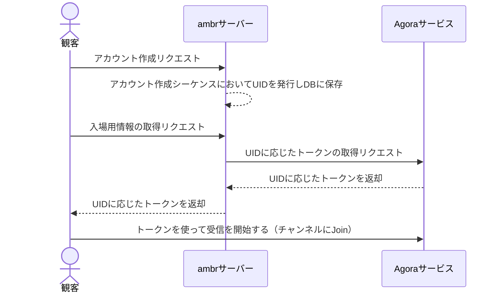

:::message
本記事はambrテックブログへ2024/8/30に投稿した記事を[ambr Tech Blog](https://zenn.dev/p/ambr_inc)のために移植したものになります。
:::

## 概要

AgoraSDK を用いて生配信受信機能を実装するにあたり、色々とつまづきながら都度対応していったので、
その際に得られた知見をいくつかまとめました。

- RtcEngine イベントハンドリング
- 動画表示領域作成
- ミュート
- トークン生成

なお、本記事では **Agora SDK で生配信機能を実装する手順をすべて説明する趣旨のものではありません** 。
これについては公式の技術記事などをご参照いただくほうが正確な情報が得られるかと思います。

## 開発環境

- Unity 2021.1.28f
- Agora SDK 4.0.0

## 課題

直近のプロジェクトにおいて、ESportsの生配信を低遅延かつ安定して受信したいという課題がありました。
今回は TOKYO GAME SHOW VR 2021でも利用実績のあった Agora SDK を引き続き利用することとなりましたが、
Agora SDK のメジャーアップデートがかかったことにより、実装の変更が必要となりました。

## Agora SDKの選定理由

以下の理由から Agora SDK を生配信用ライブラリとして選定しました。

- TGSVR2021 で過去に利用しており、短かい開発期間での実装確度が高いこと
- 「ゲーム大会の生配信」がメインコンテンツで、かつ当日にどの程度接続数がくるか未知数だったため、大規模配信の実績があるライブラリが好ましいこと
- 生配信用のサーバーの配置、運用を検討しなくて済むこと

## つまづいたポイント

### 基本的な考え方について

Agora SDKは、基本的には **チャットツール** としての側面が強いです。
そのため、ストリーマーと観客がそれぞれ同じ部屋に入場して、
その部屋の中で「どの人の動画を見るか」「どの人の音声を聴くか」を指定することで配信機能を実現している、というのが実際のところです。

:::message
Agora SDK は 1 : n の配信ではなくチャットツールとして認識すると実装の見通しが良くなる
:::

### RtcEngine イベントハンドリング

Agora SDK からのイベントは、 `IRtcEngineEventHandler` を継承したクラスを `IRtcEngine.InitEventHandler(IRtcEngineEventHandler engineEventHandler)` で登録することでハンドリング可能となります。

ここで躓くのが、**エラー発生時に `OnError` メソッドが必ずしも呼ばれない** ということです。
複数チャンネルへの入退場を繰り返す動作をしていた際に、 `OnClientRoleChangeFailed` が呼ばれることがあり、その際には `OnError` が呼ばれていませんでした。
`IRtcEngine` のユーザークラスで振る舞いを制御したい場合に状態遷移の漏れが発生しがちなので注意が必要です。

```cs
public class MyRtcEngineEventHandler: IRtcEngineEventHandle
{
    #region IRtcEngineEventHandler
    /// <summary>
    /// 失敗時の処理
    /// </summary>
    public override void OnError(int err, string msg)
    {
        Debug.LogError($"Agora OnError msg: " + msg);

        // err を ERROR_CODE_TYPE としてパースして処理
    }

    /// <summary>
    /// クライアントロールの変更時のエラー発生時処理
    /// OnError に入らないエラーが発生するためこちらでもハンドリング
    /// </summary>
    public override void OnClientRoleChangeFailed(RtcConnection connection, CLIENT_ROLE_CHANGE_FAILED_REASON reason, CLIENT_ROLE_TYPE currentRole)
    {
        Debug.LogError($"Agora OnClientRoleChangeFailed reason: " + reason);
        
        // reason 等を見ながら処理
    }
}
```

:::message
`IRtcEngineEventHandler.OnClientRoleChangeFailed` を忘れず定義する
:::

### 動画表示領域作成

まず、**通常状態だと動画は配信画面に対して左右反転状態で表示されます**
そちらの反転フラグは設定項目として存在するのですが、 **少なくとも Agora SDK 4.0 においてはこちらのフラグは有効に動作しません** でした。
（Agora SDK 4.1.0 では修正されている可能性はありましたが、バージョンアップしたのが開発終盤だったため検証していません）

```cs
// Agora SDK 4.0 ではこれでも左右反転が直らない
rtcEngine.SetLocalRenderMode(RENDER_MODE_TYPE.RENDER_MODE_FIT, VIDEO_MIRROR_MODE_TYPE.VIDEO_MIRROR_MODE_ENABLED);
```

#### 対策

**動画配信用のマテリアルの `Tiling.x` を負の値にする** ことで対応しました
ただし、この対応の有無によらず **UnityEditor上では動画が反転します**
ビルドでは正常に表示されるようになるため、配信テストでは毎回ビルドする必要がありました。


:::message
配信テストは必ずビルドを通じて行うこと。
画面の反転はマテリアルの Tiling で対応可能
:::

### ミュート

先に述べたように Agora SDK は基本的にはチャットツールなので、
何も考えずに実装すると **観客の声が全員に聞こえてしまいます。**
ストリーマーのUIDを取得するようにして、ストリーマー以外の声をミュートにする処理が必須となります。

```cs
/// <summary>特定のチャンネル以外の音声と動画をミュートにする</summary>
/// <param name="uid">ミュートにしないUID</param>
private void ObserveCertainUidAndMuteAll(uint uid)
{
    // All mute
    rtcEngine.MuteAllRemoteAudioStreams(true);
    rtcEngine.MuteAllRemoteVideoStreams(true);

    // unmute
    if (uid == 0) return;
    rtcEngine.MuteRemoteVideoStream(uid, false);
    rtcEngine.MuteRemoteAudioStream(uid, false);
}
```

:::message
観客側もストリーマーのUIDを特定可能なようにデータを渡す必要がある。
一旦全員の音声と動画をミュートにしてから配信者の音声と動画をアンミュートする
:::

### トークン生成

「UID」を「0」に指定してトークンを生成すると全UIDにて利用可能なワイルドカード的なトークンが発行できます。
また、トークン発行時に role （Subscriberなど）を指定できるのですが、
OBS + Agora RTC Tools で配信する場合にはなぜかその指定が無視されて動画/音声の配信が可能となっています。

上記から何が想定されるかというと、
**「UID」を「0」に指定したトークンを観客に広く共有してしまうと、配信の乗っ取りリスクが発生してしまいます。**
そのため、今回のシステムではチャンネル内部で「UID」が必ず一意になるように ambr サーバー側で制御し、
ストリーマー/観客はそれぞれ ambrサーバーから返却された情報を元に生配信を受信するように設計しました。





:::message
トークン生成時にはUIDを必ず指定するように心がける
:::

### OculusQuest でのフレーム落ち発生と Agora RTC Tool の配信設定

生放送のテストをするにあたり、OculusQuest2で動画のフレーム落ちが発生する事案が発生しました。

#### 原因

テスト時に送信側の画質設定が意図せず FHD、60FPS となっており、
OculusQuest2 側での処理落ちが発生していたことに起因していたと思われます。

#### 対策

当初 OBS Studio の Agora RTC Tool -> Agora Rtmp の Width / Height を HD 相当（1280x720）にしていたのですが、
実際には OBS Studio 自体の設定の 映像 -> 基本（キャンバス）解像度と  出力（スケーリング）解像度を両方 HD 相当にすることで
正常に表示されるようになりました。


:::message
Agora の受信時解像度は送信側に依存し、OBSから送信する場合にはOBS側の設定画面の解像度も変更する必要がある
:::

## まとめ

Agora SDK によって実践的な機能を実装するにあたっては、
公式記事だけでは賄えない細かな動作検証とノウハウが必要不可欠でした。
ただ、Agora による生配信自体は非常に低遅延で強力な機能であり、
技術検証レベルであれば無料で試せる魅力的なライブラリですので、
ぜひ利用してみてください。

こちらの記事が今まさにAgora SDKでつまづいている方の一助となれば幸いです。

## 参考記事

- [https://qiita.com/v-cube/items/b043065c7504a372f2b2:title]
